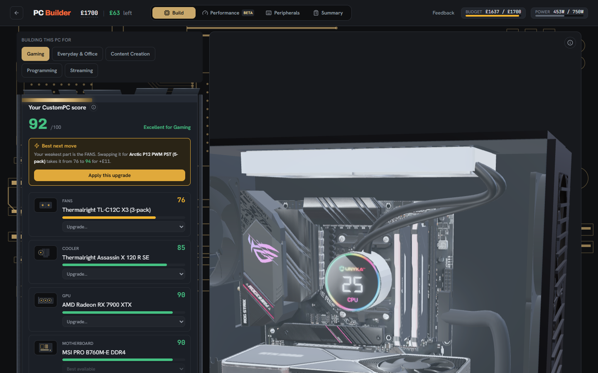
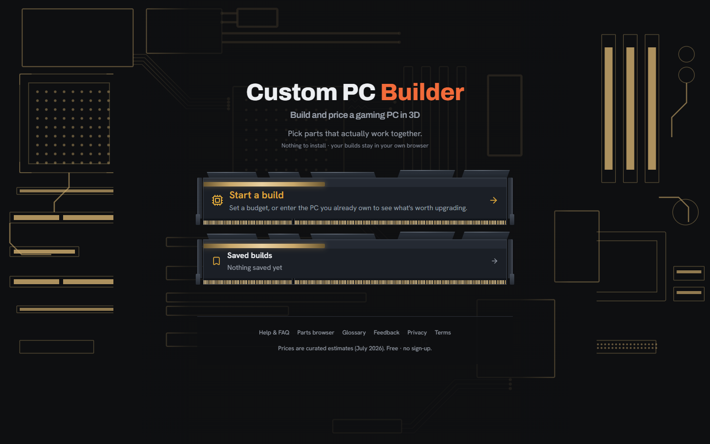
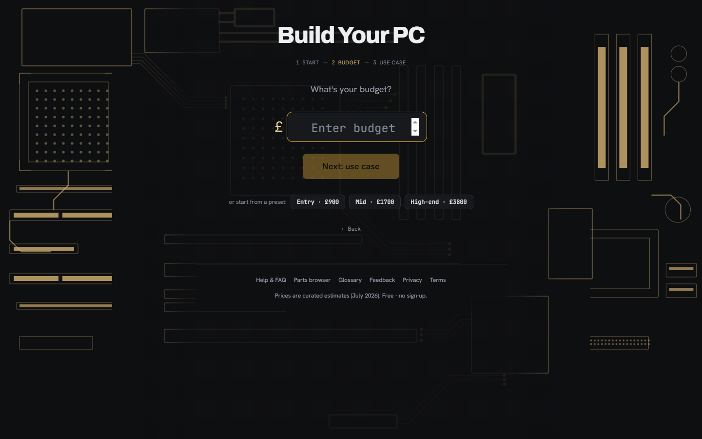
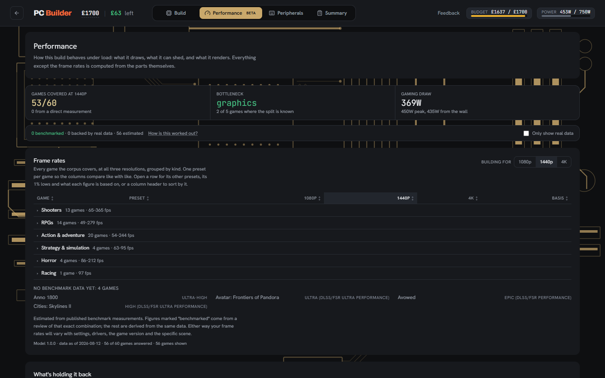
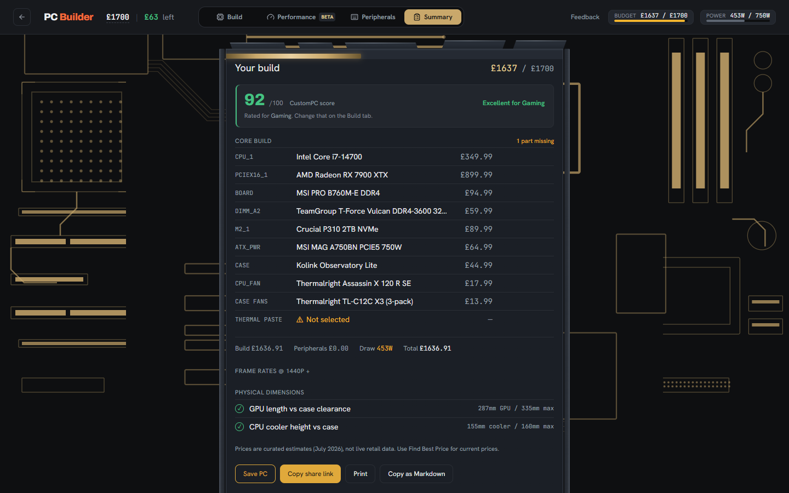

# Custom PC Builder

Plan a compatible custom gaming PC in 3D — live at [custompcbuilder.netlify.app](https://custompcbuilder.netlify.app/).

Enter a budget (or pick a quick-start tier), then assemble a build part by part.
The app checks compatibility as you go, estimates real-game FPS, flags
bottlenecks, and renders the machine in an interactive 3D case.



## Screenshots

| | |
|---|---|
|  |  |
| **Home** — the two ways in | **Setup** — a budget or a quick-start tier |
|  |  |
| **Performance** — per-game FPS at three resolutions, each row labelled with what it is based on | **Summary** — the finished build, ready to save, share or export |

## Features

- **3D build view** — parts appear inside a stylised case as you pick them (react-three-fiber), with a see-through toggle
- **Auto-build** — fills the remaining slots with the best-value compatible parts for your budget
- **Compatibility guardrails** — socket, RAM type, PSU wattage, GPU length / cooler height vs. case dimensions
- **Performance estimates** — bottleneck balance, est. average FPS at 1080p/1440p/4K, and per-game FPS for popular titles
- **Budget tracking** — live spend/remaining, parts over budget are locked (swaps credit back the part you're replacing)
- **Peripherals** — monitor, keyboard, mouse, headset alongside the core build
- **Save, share & compare** — named saved builds (localStorage), shareable `?build=` links, print/markdown export, side-by-side comparison of two saved builds
- **The in-progress build persists** across refreshes

## Stack

React 19 + Vite, Tailwind CSS, Zustand (state), three.js via @react-three/fiber + drei,
Supabase (PostgreSQL) for the catalogue, Vitest + Testing Library, Playwright, deployed on Netlify.

## Architecture

```
src/
  screens/       BuilderScreen — the one routed screen
  components/    ~45 UI components
    models/      one react-three-fiber component per part category
    performance/ the per-game frame-rate table
    art/         drawn SVG artwork for every part and game
  lib/           60 framework-free modules — the actual logic
    perfEngine/  18 modules: the frame-rate model
  store/         3 Zustand stores (builder, catalog, saved)
  hooks/         routing
  data/          bundled catalogue + fitted performance model
data/            research inputs: benchmarks, spec tables, source URLs
scripts/         22 Node scripts (model fitting, catalogue push, pre-render, sitemap)
e2e/             Playwright specs
```

The rule the layout enforces: **`src/lib` never imports React.** Compatibility
rules, the performance model, budget maths and the build codec are all plain
modules, so they are testable without rendering anything — which is why the unit
suite is large and fast.

### Where the data comes from

```
data/benchmarks/entries.json ──> scripts/fit-perf-model.mjs ──> src/data/perfModel.json
src/data/partsData.json ────────> scripts/catalog-push.mjs ───> Supabase (parts/peripherals/games)
                                                                     │
                     bundled JSON snapshot ◄── fallback ─────────────┘
                                  │
                          useCatalogStore ──> useBuilderStore ──> UI
```

The app ships with the catalogue bundled as JSON and then overrides it from
Supabase on mount. If the API is unreachable the bundled snapshot is what you
get, so the site still works — but it also means **a data fix isn't live until
it is pushed to Supabase**, which `npm run catalog:push` does and deployment
does not.

## Key technical decisions

**The performance engine reports its own basis.** Every frame-rate figure is
labelled with where it came from — a measured benchmark for that exact
CPU/GPU/game/preset combination, or an inference from the fitted model. Phase 1
deliberately shipped with gaps rather than filling them, on the reasoning that
an engine that invents numbers before it can say how confident it is has no way
to earn trust back.

**Architecture efficiency is fitted, not assumed.** `shaders × clock × 2` is
arithmetic over published figures, but how much of that a game realises differs
by vendor — Ada counts a shared FP32/INT32 datapath, RDNA 3 publishes 6144 and
12288 shaders for the same silicon. Raw throughput therefore ranks an RTX 4070
Ti above an RX 7900 XTX, which is wrong in raster. `perfEngine/archEfficiency.js`
learns a per-architecture correction from the cards the corpus *does* measure and
applies it to the ones it doesn't, recording how many parts backed each
correction so a thin architecture is left uncorrected rather than guessed at.

**One definition of "this PSU is too small".** Three call sites used to carry
their own and disagreed at exact equality, so a 400 W unit on a 400 W build was
allowed when picking the supply, blocked when picking anything else, and called
critical in the warnings panel. `psuTooSmall` is now exported from
`lib/compatibility.js` and shared, and `compatible` is derived rather than stored
alongside a status that could contradict it.

**Component specs are researched, not estimated.** GPUs, motherboards, cases and
PSUs are at 100% sourced coverage — every spec field traced to manufacturer
documentation, with the URL recorded in `data/partSources.json`.
`npm run catalog:coverage` reports it and a test fails if a researched field
loses its source.

**Self-hosted fonts.** Google Fonts sent every visitor's IP to Google before they
consented to anything. The faces are served from `public/fonts` and declared in
`src/fonts.css`; the CSP has no font CDN in it, so re-adding one breaks the build
rather than silently reintroducing the transfer.

## Testing

| Suite | What it covers | Command |
|---|---|---|
| Vitest — 1,602 tests / 150 files | logic, stores, components in jsdom | `npm run test:run` |
| Playwright — 56 specs / 14 files | real layout and CSS, which jsdom has none of | `npm run test:e2e` |
| Playwright `csp` project | the production Content-Security-Policy | part of `test:e2e` |

The split is the point. jsdom computes no layout, so a layout bug cannot fail a
unit test. And no dev server sends a CSP, so a CSP failure cannot appear anywhere
but a deploy — the `csp` project builds the app and serves it with
`public/_headers` actually applied.

Two directives there are load-bearing for the 3D view and neither is exercised in
development: `connect-src blob:` (GLTFLoader unpacks embedded textures to blob:
URLs and reads them back with `fetch`) and `script-src 'wasm-unsafe-eval'`
(`motherboard.glb` uses EXT_meshopt_compression, whose decoder compiles WASM).

## CI & deployment

GitHub Actions runs lint → unit → build → e2e → CSP on every push and PR, plus
drift checks on the two committed generated artefacts (the pre-rendered route
fragments and the sitemap) that otherwise go stale silently. Netlify deploys from
`main`.

The catalogue is the exception: **code deploys from `main`, the catalogue never
does.** It is pushed explicitly with `npm run catalog:push`.

## Running it locally

Requires Node 24.

```bash
npm install
npm run dev          # dev server on :5173
```

No environment variables are needed — the Supabase URL and publishable key are
committed, and are safe to be: the catalogue tables are `SELECT`-only for
anonymous users under row-level security, and no write policy exists. Set
`VITE_SUPABASE_URL` and `VITE_SUPABASE_PUBLISHABLE_KEY` to point at a different
project.

```bash
npm run test:run         # unit tests
npm run test:e2e         # end-to-end (needs npx playwright install chromium)
npm run lint
npm run build            # production build + pre-render
npm run catalog:coverage # spec research coverage per category
npm run catalog:check    # is the live catalogue in step with the repo?
npm run perf:fit         # refit the performance model from data/benchmarks
```

## A note on the data

Prices are curated estimates, not live retailer feeds. Performance figures are
derived from published third-party benchmarks (see `data/benchmarks/sources.json`)
and are labelled in the UI as measured or inferred. This is a planning tool, not
a price comparison site.
